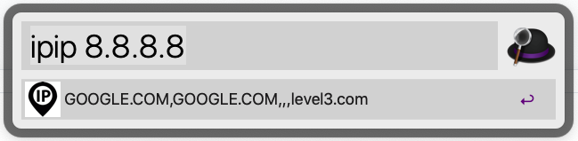
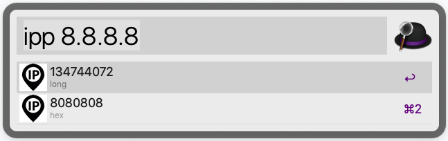
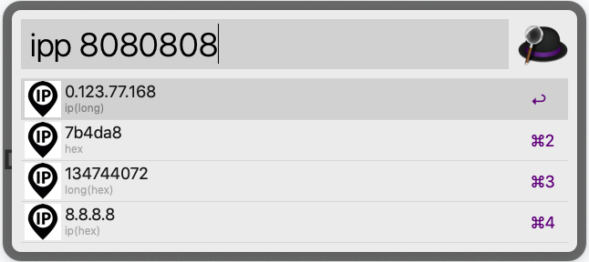
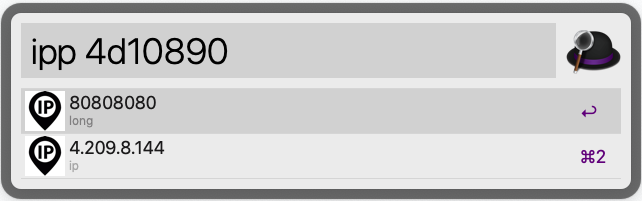

# ipip-alfred
geo ip query &amp;&amp; ip parse

# usage
## geo ip query

## ip parse

# download
[ipip.alfredworkflow](https://github.com/kiyonlin/ipip-alfred/releases/download/v1.0/ipip.alfredworkflow)
